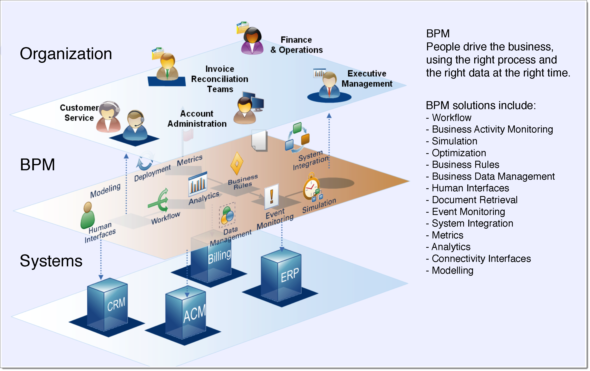
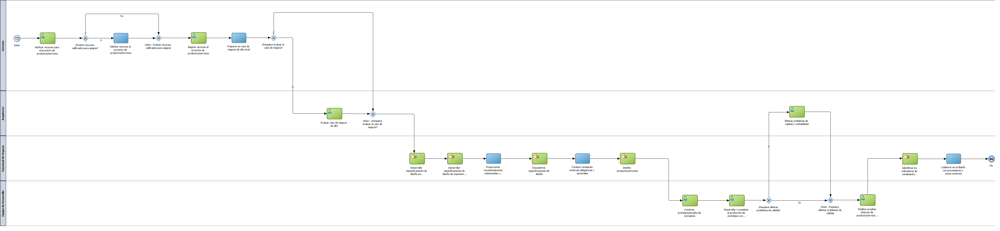
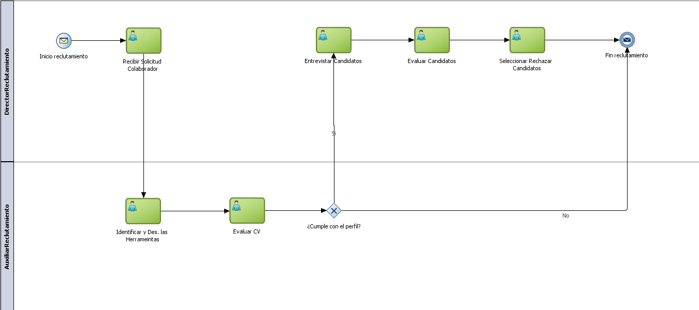
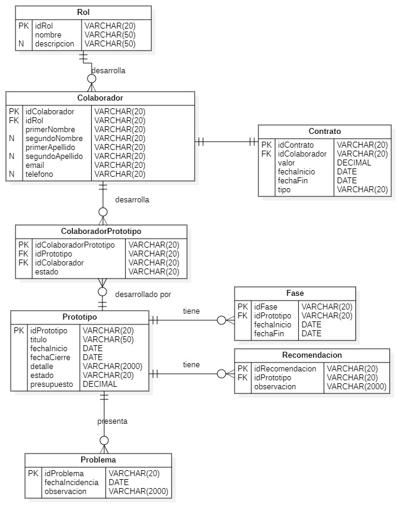
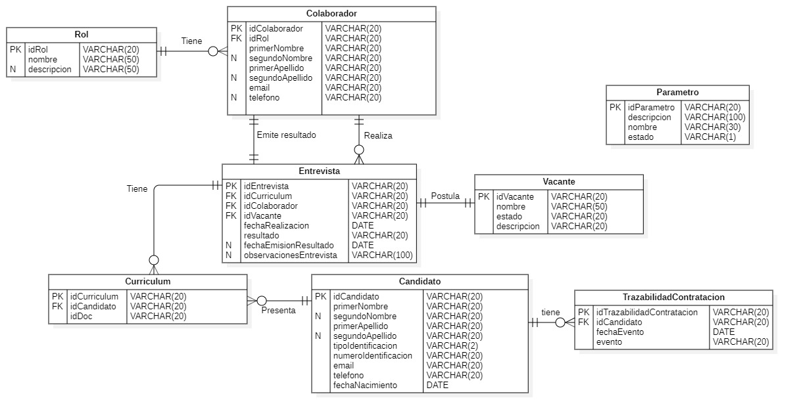

# TABLA DE CONTENIDO

1. [Projecto Final Procesos de Negocio](#Projecto-Final-Procesos-de-Negocio)
    1. [AS-IS](#AS-IS)
    2. [TO-BE](#TO-BE)
    3. [Other information](#other-information)
        

# Projecto Final Procesos de Negocio

El siguiente proyecto ilustra la aplicación de los conceptos aprendidos en clase  y desarrollar el TO-BE para la capacidad de negocio seleccionada por el grupo para el desarrollo de las actividades de la asignatura

### AS-IS 

Después de el proceso de evaluación con APQC de describe el AS-IS de la capacidad de negocio seleccionada:

### Diagramas

#### Proceso Estrategico

#### Proceso de Soporte

### TO-BE

Después de realizar una evaluación del proceso existente se realizaron las mejoras respectivas que se visualizan en los siguientes diagramas BPMN:

### Diagramas

Nota: Insertar diagramas

## Descripción del Ambiente

Para el desarrollo del proyecto se seleccionaron productos Oracle en su versión 12c y otras herramientas que contribuyeron a construir el ambiente de desarrollo de la solución propuesta, dichas herramientas se describen a continuación:

| Nombre de la Herramienta | Versión |
|---|:-:|
| Clientes |  |
| Equipo comercial |  |
| Equipo de mercadeo |  |
| Equipo técnico | X |  

## Estructura del proyecto

## 

## Built With

* [jDeveloper](http://www.dropwizard.io/1.0.2/docs/) - The web framework used
* [Oracle SoaSuite 12c](https://maven.apache.org/) - Dependency Management
* [Oracle Database 12cR2](https://rometools.github.io/rome/) - Used to generate RSS Feeds

## Modelo E-R de la solución

### Modelo E-R Proceso Estratégico

### Modelo E-R Proceso de Soporte

## Versiones

Para llevar un mejor control de los fuentes y su trazabilidad el equipo decidio utilizar repositorios git y [gitlab](https://gitlab.com/wortiz1027/app_eaes_soaint.git) para mantener centralizado 

## Autores

* **Brian Suarez Botia** - *Encargado del diseño del modelo de base de datos y los procedimeintos alamacenados, creación y configuración de indicadores en Oracle BAM 12c*
* **Eduardo Franco Rivera** - *Encargado de definición de procesos AS-IS y TO-BE e implementación de vistas Oracle ADF 12c*
* **Jhon Celemin Florez** - *Encargado de la creación del ambiente de gestión documental y crear las estructuras documentales y los web services para consultar los documentos*
* **Wilman Ortiz Navarro** - *Encargado de la creación del ambiente Oracle SoaSuite con todas las herramientas necesarias, adicional la creación de los BPELs para la centralización de los servicios que van a consumir las actividades y las vistas de los procesos*

## License

This project is licensed under the MIT License - see the [LICENSE.md](LICENSE.md) file for details